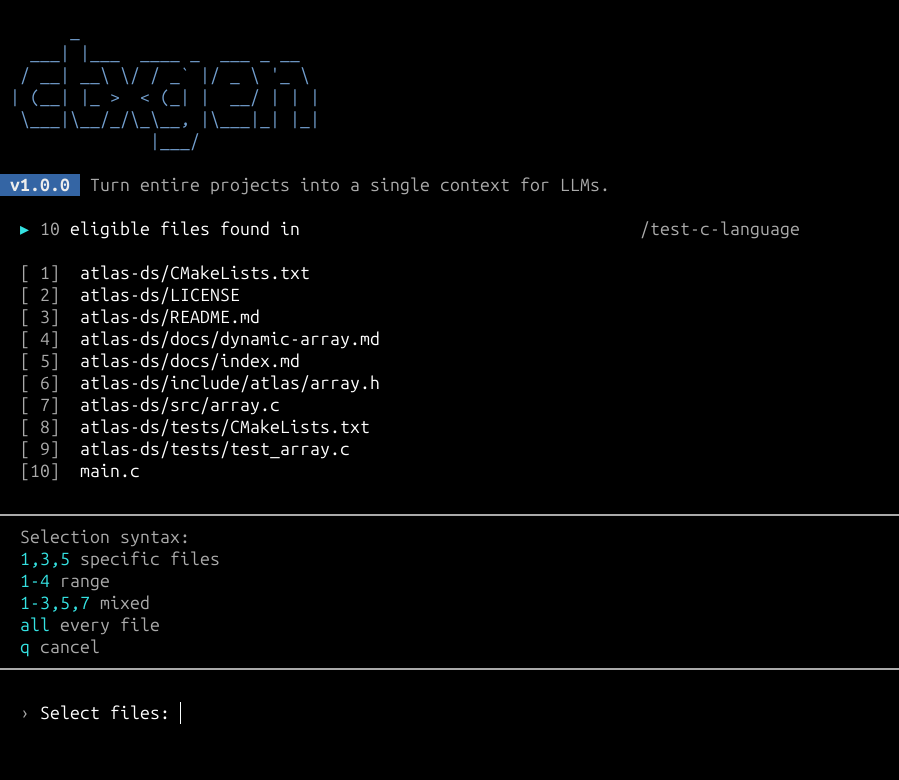
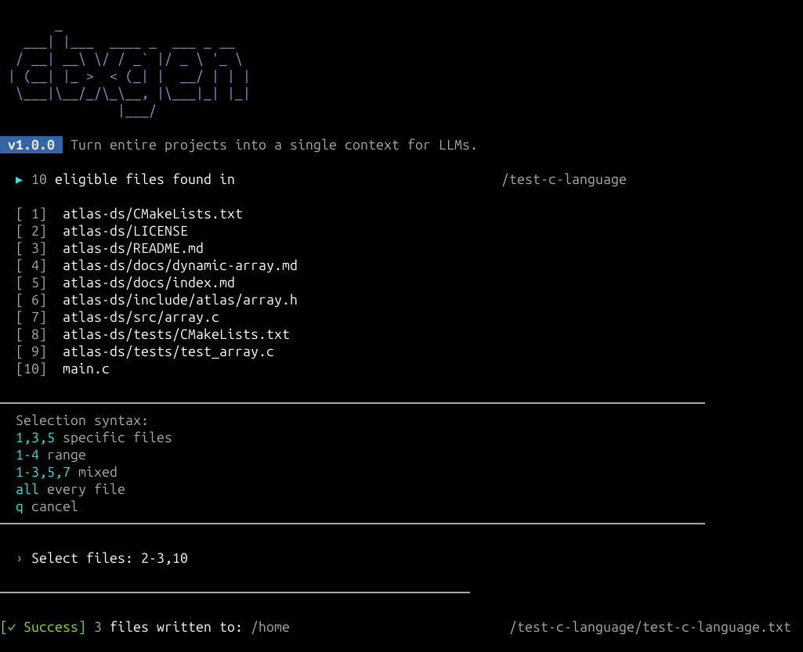

<div align="center">

<h1>ctxgen</h1>

<p>A sleek CLI tool to bundle your source code into a single text file for AI context windows.</p>

<p>
  
  
  
  
</p>

</div>

---

> [!NOTE]
> Easily pack your project repository into a clean, structured prompt context for ChatGPT, Claude, Gemini, or any other LLM.

---

## Table of Contents

- [Overview](#overview)
- [Features](#features)
- [Selection Syntax](#selection-syntax)
- [Installation](#installation)
- [Usage](#usage)
- [Project Structure](#project-structure)
- [Developer](#developer)
- [License](#license)

---

## Overview

**ctxgen** eliminates the tedious task of copying and pasting individual source files when providing project context to AI models. Whether you need to feed an entire codebase or just a few specific files into an LLM, ctxgen scans your workspace, lets you interactively pick what matters, and outputs a neatly delimited text file ready for your prompt — in seconds.

### Preview

<p align="center">
  <em>The tool recursively discovers all eligible files matching your parameters, presents them in an indexed list, and provides an immediate syntax guide for custom selection.</em><br>
  <br><br>
  <em>After submitting a valid pattern selection (supporting indices, ranges, or mixed formats), the operations resolve into a structured text bundle with an aesthetic confirmation message</em><br>
  <br><br>
</p>

---

---

## Features

- **Smart Workspace Scanning** — Automatically filters out noisy directories (`.git`, `node_modules`, `venv`, `__pycache__`, etc.) out of the box.
- **Granular Interactive Selection** — Choose specific files, ranges, or everything at once using an intuitive, flexible index parser.
- **Extension Filtering** — Isolate exactly what you need by targeting specific extensions (e.g., only `.py` or `.ts` files).
- **Binary Safety Guardrails** — Safe processing that bypasses non-text and binary files preventing corrupted outputs.
- **Modern Terminal UX** — Clean, color-coded ANSI interface featuring custom banners, real-time feedback, and dynamic processing spinners.

---

## Selection Syntax

When prompted to select files, you can use combinations of the following patterns:

| Pattern | Description | Example |
|---|---|---|
| `all` | Selects all eligible files found | `all` |
| `comma-separated` | Selects specific file numbers | `1,3,5` |
| `hyphen-range` | Selects a continuous range of files | `1-4` |
| `mixed` | Combines numbers and ranges | `1-3,5,7` |
| `q` | Aborts the operation immediately | `q` |

---

## Installation

### 1. Clone the repository

```bash
git clone https://github.com/avieira-dev/ctxgen.git
cd ctxgen
```

### 2. Make the script executable

```bash
chmod +x ctxgen
```

> [!TIP]  
> The root `ctxgen` script acts as the entry-point runner, bootstrapping the internal source modules automatically.

### 3. Create a global symlink (Linux / macOS)

```bash
sudo ln -s "$(pwd)/ctxgen" /usr/local/bin/ctxgen
```

Once linked, `ctxgen` is available system-wide from any terminal session.

> [!NOTE]  
> To uninstall, simply remove the symlink:  
> sudo rm /usr/local/bin/ctxgen

---

## Usage

Run the tool using the `txt` command followed by any optional flags:

### Command Structure

```bash
ctxgen generate txt [options]
```

### Quick Examples

```bash
# 1. Run with defaults (Scans current folder, saves to <folder-name>.txt in CWD)
ctxgen generate txt

# 2. Scan a specific folder, filter extensions
ctxgen generate txt -d ~/Projects/my-app -e .py .js

# 3. Scan current folder but save the output package into a custom local file
ctxgen generate txt -o ./my-prompt-context.txt
```

### Available Options

| Flag | Short | Default | Description |
|---|---|---|---|
| `--dir` | `-d` | `.` *(Current folder)* | Target directory path to scan. |
| `--out` | `-o` | `<dir-name>.txt` | Custom output path for the bundled text file in the CWD. |
| `--ext` | `-e` | *None (All files)* | Space-separated list of extensions to include (e.g., .py .js). |
## Project Structure

```plaintext
ctxgen/
├── src/
│   └── ctxgen/
│       ├── __init__.py
│       ├── cli.py
│       ├── core.py
│       ├── main.py
│       └── utils/
│           ├── colors.py
│           └── messages.py
├── .gitignore
├── ctxgen
├── pyproject.toml
├── LICENSE
└── README.md
```

---

## Developer

**Alexandre Vieira**
GitHub: [@avieira-dev](https://github.com/avieira-dev)

---

## License

Distributed under the [MIT License](LICENSE). See `LICENSE` for details.