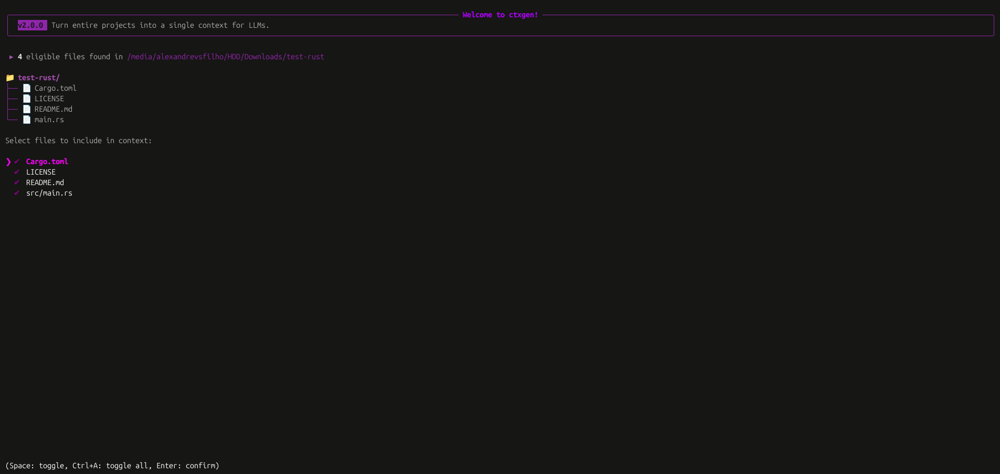
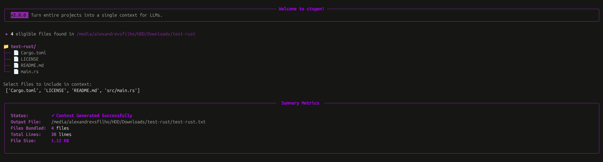
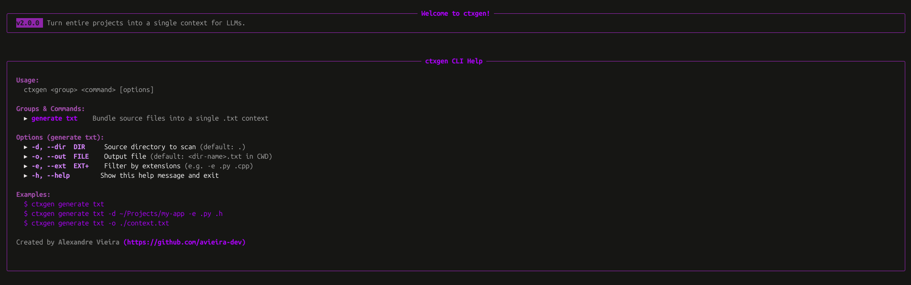

<div align="center">
    <h1>ctxgen</h1>
    <p>A sleek CLI tool to bundle your source code into a single text file for AI context windows.</p>
    <p>
        
        
        
        
        
        
    </p>
</div>

---

## Overview

**ctxgen** eliminates the tedious task of copying and pasting individual source files when providing project context to AI models. Whether you need to feed an entire codebase or just a few specific files into an LLM, ctxgen scans your workspace, presents a clear directory tree, lets you interactively toggle what matters, and outputs a neatly delimited text file ready for your prompt — in seconds.

> [!NOTE]  
> Easily pack your project repository into a clean, structured prompt context for ChatGPT, Claude, Gemini, or any other LLM.

---

## Table of Contents

- [Showcase](#showcase)
- [Features](#features)
- [Interactive Controls](#interactive-controls)
- [Installation](#installation)
- [Usage](#usage)
- [Project Structure](#project-structure)
- [Author](#author)
- [License](#license)

---

## Showcase

<p align="center">
  <em>The tool recursively discovers all eligible files matching your parameters, displays a visual directory tree structure, and opens an interactive checkbox selection menu.</em><br>
  <br><br>
  <em>After confirming your selection, files are seamlessly bundled into a structured text document alongside rich metric statistics.</em><br>
  <br><br>
  <em>Help and available commands.</em><br>
  <br><br>
</p>

---

## Features

- **Smart Workspace Scanning** — Automatically filters out noisy directories (`.git`, `node_modules`, `venv`, `__pycache__`, etc.) out of the box.
- **Visual Directory Tree View** — Renders a clean hierarchical tree using Rich before file selection for full structural visibility.
- **Interactive Checkbox Selector** — Easily select, toggle, or batch-select files using arrow keys and hotkeys powered by InquirerPy.
- **Extension Filtering** — Isolate exactly what you need by targeting specific extensions (e.g., only `.py` or `.ts` files).
- **Binary Safety Guardrails** — Safe processing that bypasses non-text and binary files preventing corrupted outputs.
- **Tech Purple CLI Theme** — Modern ANSI interface with custom panels, real-time progress indicators, and dynamic metrics reporting.

---

## Interactive Controls

When selecting files in the CLI interactive menu, use the following keybindings:

| Keybinding | Action                                      |
|:-----------|:--------------------------------------------|
| `Space`    | Toggle selection for the focused file       |
| `Ctrl + A` | Toggle selection for **all** eligible files |
| `↑` / `↓`  | Move selection cursor up and down           |
| `Enter`    | Confirm selection and start bundling        |
| `Ctrl + C` | Abort operation gracefully                  |

---

## Installation

### 1. Clone the repository

```bash
git clone https://github.com/avieira-dev/ctxgen.git
cd ctxgen
```

### 2. Create the virtual environment

> [!NOTE]  
> Creating the virtual environment is **required** for ctxgen to work correctly.  
> The root `ctxgen` launcher uses the Python interpreter located at `.venv/bin/python`. Therefore, the `.venv` directory must exist before running the application.

```bash
python3 -m venv .venv
```

> [!IMPORTANT]  
> Do not skip this step. The `ctxgen` launcher is configured to use the project's `.venv` Python interpreter instead of the system Python installation.

### 3. Activate the virtual environment (Linux/macOS)

On Linux/macOS:

```bash
source .venv/bin/activate
```

### 4. Install dependencies

With the virtual environment activated, install the required dependencies:

```bash
pip install rich InquirerPy
```

> [!IMPORTANT]  
> Installing these dependencies inside the `.venv` is required. Do not install them system-wide or rely on `pip install --user`.

After installation, you can deactivate the environment:

```bash
deactivate
```

You do not need to activate `.venv` every time you run `ctxgen`. The root launcher automatically uses `.venv/bin/python`.

### 5. Make the script executable

```bash
chmod +x ctxgen
```

> [!TIP]  
> The root `ctxgen` script acts as the entry-point runner, locating the project directory and launching the application with its dedicated virtual environment.

### 6. Create a global symlink (Linux / macOS)

Create a symbolic link so ctxgen can be executed from any directory:

```bash
sudo ln -s "$(pwd)/ctxgen" /usr/local/bin/ctxgen
```

Once linked, `ctxgen` is available from any terminal session and can be executed from any working directory.

> [!NOTE]  
> To uninstall the global command, simply remove the symlink:

```bash
sudo rm /usr/local/bin/ctxgen
```

---

## Usage

Run the tool using the `txt` command followed by any optional flags:

### Command Structure

```bash
ctxgen generate txt [options]
```

### Quick Examples

```bash
# 1. Run with defaults (Scans current folder, saves to <folder-name>.txt in CWD)
ctxgen generate txt

# 2. Scan a specific folder, filter extensions
ctxgen generate txt -d ~/Projects/my-app -e .py .js

# 3. Scan current folder but save the output package into a custom local file
ctxgen generate txt -o ./my-prompt-context.txt
```

### Available Options

| Flag    | Short | Default                | Description                                                    |
|---------|-------|------------------------|----------------------------------------------------------------|
| `--dir` | `-d`  | `.` *(Current folder)* | Target directory path to scan.                                 |
| `--out` | `-o`  | `<dir-name>.txt`       | Custom output path for the bundled text file in the CWD.       |
| `--ext` | `-e`  | *None (All files)*     | Space-separated list of extensions to include (e.g., .py .js). |

---

## Project Structure

```plaintext
ctxgen/
├── src/
│   └── ctxgen/
│       ├── __init__.py
│       ├── cli.py
│       ├── core.py
│       ├── main.py
│       └── utils/
│           └── messages.py
├── .gitignore
├── ctxgen
├── pyproject.toml
├── LICENSE
└── README.md
```

> [!NOTE]  
> The `.venv` directory is intentionally omitted from the project structure because it is a local virtual environment and should not be committed to version control.

---

## Author

**Alexandre Vieira**  
GitHub: [@avieira-dev](https://github.com/avieira-dev)

---

## License

Distributed under the [MIT License](LICENSE). See `LICENSE` for details.